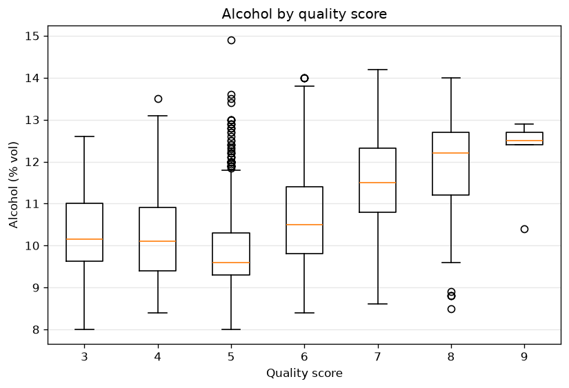
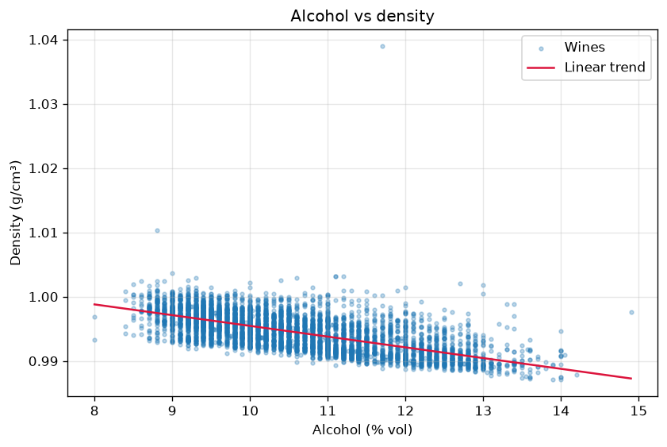
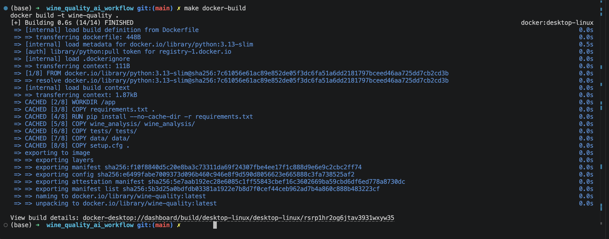
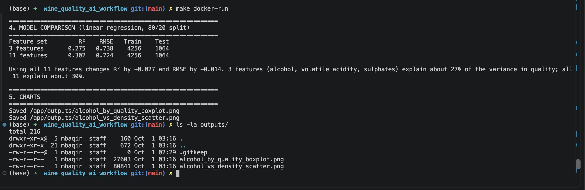

# Wine Quality Analysis

## 1. Project and question

**Question:** Can a few basic chemical measurements (like alcohol content) give us a good idea of a wine's quality score?

**Dataset:** [`data/wine_quality_merged.csv`](data/wine_quality_merged.csv) contains 6,497 red and white wines, 11 lab-measured chemical features, a `type` column (`red`/`white`) and an integer `quality` score (3–9).

The pipeline runs load → inspect → clean → explore → model → charts. It is a small Python package that runs the same way locally and in Docker.

## 2. Assignment option

Option 2: rebuilding my previous Wine Quality project using an Architect → Builder → Tester AI workflow.

## 3. Setup and usage

Requires Python 3.13 and `make`. Docker is needed only for the Docker targets.

```bash
make install    # create .venv (Python 3.13) and install requirements.txt into it
make run        # run the full analysis, charts go to outputs/
make test       # pytest
make lint       # black --check + flake8
make format     # black
make clean      # remove caches and generated charts (keeps .venv)
```

If `python3.13` is not on your PATH, run `make install PYTHON=/path/to/python3.13`. Every local target calls `.venv/bin/python -m ...` directly, so you don't need to activate the venv and nothing is installed into the base environment.

**Docker:**

```bash
make docker-build   # docker build -t wine-quality .
make docker-run     # run the analysis; charts appear in ./outputs
make docker-test    # run the test suite inside the image
```

**Optional, Docker Compose:**

```bash
docker compose up --build        # or: make compose-up (also runs `docker compose down`)
docker compose run --rm tests    # or: make compose-test
docker compose down
```

**Environment variables:**

| Variable | Default (local) | Default (container) | Purpose |
|---|---|---|---|
| `WINE_DATA_PATH` | `data/wine_quality_merged.csv` | `/app/data/wine_quality_merged.csv` | input CSV |
| `WINE_OUTPUT_DIR` | `outputs/` | `/app/outputs` | chart folder (created if missing) |

```bash
WINE_OUTPUT_DIR=/tmp/wine_charts make run

# Run the container on other data: mount it read-only and point the variable at it
docker run --rm \
  -v "/some/dir:/input:ro" -e WINE_DATA_PATH=/input/file.csv \
  -v "$(pwd)/outputs:/app/outputs" \
  wine-quality
```

The CSV must contain the same 13 columns, and the 11 chemical columns and `quality` must be numeric. Any extra columns are dropped on load, so they cannot affect duplicate detection or the missing-value check. A missing column, a non-numeric value, an empty file, or a file with no data rows makes `load_data` raise a clear `ValueError`.

> **Change beyond the original plan (approved by me during testing):** the Tester found that `load_data` only checked that the 13 columns were present. Extra columns changed the cleaning results: an `id` column hid every duplicate, and a mostly empty `notes` column made almost every row count as incomplete. A text value in a numeric column crashed later with an unclear `TypeError`. I approved having `load_data` keep only the 13 expected columns and raise a clear `ValueError` for non-numeric data.

## 4. Project structure

```
wine_quality_ai_workflow/
├── data/wine_quality_merged.csv   # input dataset (not modified)
├── docs/plan.md                   # Architect's plan (the living spec)
├── docs/figures/                  # committed copies of the two charts, shown in this README
├── docs/screenshots/              # Docker screenshots for this README
├── wine_analysis/
│   ├── __init__.py    # marks the package
│   ├── config.py      # get_data_path(), get_output_dir(): env vars with defaults
│   ├── data.py        # load_data, inspect_data, clean_data; column-name constants
│   ├── explore.py     # filter helpers, summary_by_type, summary_by_quality
│   ├── model.py       # FEATURES_BASIC / FEATURES_ALL, train_and_evaluate
│   ├── plots.py       # boxplot and scatter (matplotlib, Agg backend)
│   └── main.py        # orchestrates the pipeline; the only module that prints
├── tests/
│   ├── conftest.py        # small synthetic DataFrame fixtures
│   ├── test_config.py     # defaults and env overrides
│   ├── test_data.py       # load / inspect / clean, typical and edge cases
│   ├── test_explore.py    # filters, empty results, group summaries
│   ├── test_model.py      # exact-linear R² ≈ 1, result shape, errors
│   ├── test_plots.py      # PNGs written, nested dirs created
│   └── test_pipeline.py   # regression numbers on the real CSV + end-to-end main()
├── outputs/           # generated charts (git-ignored; only .gitkeep is committed)
├── requirements.txt   # pinned dependencies
├── setup.cfg          # flake8 (max-line-length 88) and pytest config
├── Makefile           # the project's command interface
├── Dockerfile         # python:3.13-slim image that runs the analysis
├── docker-compose.yml # optional: `analysis` service + `tests` service (profile "test")
├── .dockerignore      # keeps .venv, outputs, docs and caches out of the image
├── .gitignore         # ignores .venv, caches, generated charts and raw AI transcripts
└── README.md          # this file
```

## 5. Data cleaning decisions

The raw data has 6,497 rows, 0 missing values and **1,177 exact duplicate rows**. Cleaning happens right after loading, before any exploration or modelling.

> **Note:** [`docs/plan.md`](docs/plan.md) describes the original design, where cleaning removed exact duplicates only. This README lists the changes I approved later (dropping rows with missing values, and the stricter `load_data` checks in section 3).

- **Duplicates are removed** (leaving 5,320 rows: 3,961 white and 1,359 red). Identical rows give some wines extra weight, and they can land in both the train and the test split. That leaks information and inflates test scores.
- **Rows with missing values are removed** (none in this dataset, so the results above are unaffected). Because `WINE_DATA_PATH` can point to a different CSV, this guards against incomplete data: without it, the model step (`Input X contains NaN`) and the scatter trend line (`SVD did not converge`) crash. Missing values are **not imputed**, for the same reason outliers are kept: filling them in would invent lab measurements.
  > **Change beyond the original plan (approved by me):** the Architect's plan had `clean_data` remove exact duplicates only. During review, I asked what happens with a CSV that has missing values. The Builder showed that the pipeline crashes, and I approved dropping incomplete rows in `clean_data` (duplicates first, then missing values), with the dropped counts printed for each reason.
- **Outliers are kept.** They are real, lab-measured wines, not entry errors. Removing them would bias the model toward "average" wines and drop most of the rare quality-3 and quality-9 wines.

The program prints each of these reasons, and how many rows each step removed, when it runs.

## 6. Results

Linear regression predicting `quality`, 80/20 train/test split, `random_state=42` (4,256 train and 1,064 test rows):

| Feature set | R² | RMSE |
|---|---|---|
| 3 features (`alcohol`, `volatile acidity`, `sulphates`) | 0.275 | 0.738 |
| All 11 chemical features | 0.302 | 0.724 |





(These are committed copies from `outputs/`, which is git-ignored. `make run` or `make docker-run` regenerates the charts in `outputs/`.)

**Answer: only partly.** Three basic measurements explain about 27% of the variance in quality, and using all 11 adds only about 3 percentage points. A typical prediction is off by about 0.7 of a quality point. Alcohol shows the clearest signal: median alcohol rises steadily from quality 5 upward. Alcohol and density are strongly negatively related.

**Limitations:**
- *Ordinal target:* quality is an ordered score, but linear regression treats it as continuous, so predictions come out as values like 5.7.
- *Class imbalance:* most wines score 5 or 6. Quality 3 has only 30 wines and quality 9 has only 5, so the model predicts the extremes poorly and those boxplot groups are thin.
- Quality is a subjective tasting score, so a large part of its variation is not captured by chemistry at all.

## 7. Docker

The image is based on `python:3.13-slim`, the same Python version as the local `.venv`. It installs `requirements.txt` into the container's system Python (the container is already isolated, so it has no venv) and copies in the package, tests and data. Its default command runs `python -m wine_analysis.main`. The data is included in the image, and `WINE_DATA_PATH`/`WINE_OUTPUT_DIR` default to `/app/data/...` and `/app/outputs`.

**How the charts get out:** `make docker-run` bind-mounts the host's `outputs/` folder onto `/app/outputs` (`-v "$(CURDIR)/outputs:/app/outputs"`, quoted because the repo path contains spaces). The PNGs written inside the container therefore appear in `./outputs` on the host. `make docker-test` runs `python -m pytest -q` in the same image.

### Optional: Docker Compose

`docker-compose.yml` defines two services that use the same `wine-quality` image:
- `analysis` runs the analysis with the same `./outputs:/app/outputs` mount as `make docker-run`. `docker compose up --build` starts only this service.
- `tests` runs the test suite. It sits behind the `test` profile, so `up` doesn't start it. `docker compose run --rm tests` runs it on demand.

This project doesn't strictly need Compose because it is a single container with no database or other services. Compose is included as a one-command convenience and for practice. The `make docker-*` targets remain the primary path.





## 8. Manual smoke test result

Commands (from the Manual Smoke Test in [`docs/plan.md`](docs/plan.md)):

```bash
make install
.venv/bin/python --version
rm -f outputs/*.png && make run && ls -la outputs/
WINE_OUTPUT_DIR=/tmp/wine_smoke make run && ls -la /tmp/wine_smoke/
rm -f outputs/*.png && make docker-build && make docker-run && ls -la outputs/
rm -f outputs/*.png && docker compose up --build && ls -la outputs/
docker compose run --rm tests
docker compose down
```

**Result: passed.** I ran every step myself on my Mac (Python 3.13.13, Docker Desktop) on Oct 1, 2026, before starting the Tester stage.

- **Setup:** I deleted `.venv` first to test a fresh install. `make install` recreated it and installed all pinned packages, and `.venv/bin/python --version` printed `Python 3.13.13`.
- **Local run:** after deleting the old charts, `make run` printed the expected numbers: shape `(6497, 13)`, 0 missing values, 1177 duplicates, then `Removed 1177 exact duplicate rows`, `Removed 0 rows with missing values` and `-> 5320 rows remain`. The model comparison showed R² 0.275 (3 features) and 0.302 (11 features). Both charts were created in `outputs/`.
- **Docker:** `make docker-build` finished successfully on `python:3.13-slim`. After deleting the charts again, `make docker-run` printed the same numbers, and both charts reappeared in `outputs/` on my machine through the mounted folder.
- **Charts:** I opened both. The boxplot shows alcohol rising with quality from score 5 upward, and the scatter trend line slopes down (more alcohol, lower density).
- **Docker Compose:** `docker compose up --build` started only the `analysis` service, printed the same results and then exited. `docker compose run --rm tests` gave 48 passed (58 after the Tester's fixes, which I re-ran myself), and `docker compose down` cleaned up.
- **Issue noticed:** the README originally showed the two charts from `outputs/`, but `.gitignore` excludes `outputs/*.png`, so those images would not have appeared on GitHub. The Tester confirmed this issue independently, and the charts are now copied to `docs/figures/` so they display on GitHub.

## 9. AI workflow

I used Claude Code in VS Code, with a fresh chat for each role. The only things passed between the chats were the repository and `docs/plan.md`.

- **Architect:** inspected the dataset, then wrote [`docs/plan.md`](docs/plan.md): requirements, module structure, risks, containerization, build order, the test plan and the manual smoke test. It flagged real risks I had not thought about, such as the spaces in my folder path breaking Docker mounts. I reviewed the plan and asked for corrections before any code was written.
- **Builder:** implemented the plan step by step, writing each module's tests in the same step, and explained its implementation decisions in a final summary. It stopped and asked me before going beyond the plan, which made it easy to stay in control.
- **Manual smoke test:** I ran the project myself (section 8) before the Tester started.
- **Tester:** reviewed the work independently against `docs/plan.md`, ran the tests, and probed edge cases with modified copies of the data. It found 9 issues, ranked by importance, and recommended fixes. I decided which to apply, it applied them, and I re-ran the checks myself.

Overall, splitting the work into three roles made each chat focused, and having a written plan meant the Builder and Tester could work without the earlier conversations.

## 10. AI recommendations accepted / changed

**Accepted:**
- Using matplotlib only, without seaborn, to keep dependencies small.
- The Architect's idea to run every tool as `.venv/bin/python -m <tool>`, which avoids errors caused by the spaces in my project folder path.
- I asked the Builder what would happen with a CSV containing missing values. It tested this and showed the model would crash. I approved its fix: incomplete rows are dropped during cleaning. I also agreed with its advice not to fill in (impute) values, since that would invent lab measurements.
- The Tester's recommendations to keep only the 13 expected columns when loading and to pin the README's result numbers in tests. I also kept the RMSE checks it added beyond what I asked for, since they are in the same results table.
- The Tester pointed out that `docs/plan.md` still describes the original cleaning. I decided not to edit the plan, because it belongs to the Architect; instead the README lists the changes I approved.

**Changed or rejected:**
- The Architect planned `python:3.12-slim` and installing packages into my active Python environment. I changed this to `python:3.13-slim` (matching my local Python) and a project `.venv`.
- The Architect said Docker Compose was not needed. I agreed it was not required, but added it as an optional extra for convenience and practice, keeping the `make docker-*` targets as the main path.
- The Builder tried to add "r ≈ -0.67" to the README. I stopped the edit and asked where the number came from. It had been calculated separately, not by the project code, so the number was left out, because I want every number in the README to be reproducible with `make run`.
- The Architect suggested a short starting prompt for the Builder. I used a more detailed one that also asked the Builder to explain its implementation decisions, which my assignment requires.

## 11. Independent verification

- I ran the full manual smoke test myself, starting from a deleted `.venv` to check a fresh install (section 8).
- I checked the printed counts against what I expected from the data: 6,497 rows, 0 missing values, 1,177 duplicates, 5,320 rows after cleaning.
- I opened both charts and checked they matched the written findings.
- The R² values (0.275 for 3 features, 0.302 for 11) match the results of the same comparison in my previous version of this project.
- I noticed during the smoke test that the README charts would not display on GitHub, before the Tester reported it.
- After the Tester's fixes, I re-ran `make lint`, `make test`, `make docker-test` and `docker compose run --rm tests` myself (58 passed).

## 12. Comparison with the previous version

| Previous version | This rebuild |
|---|---|
| one large analysis file | modules with one job each (`config`, `data`, `explore`, `model`, `plots`, `main`) |
| cleaning added at the end | cleaning done first: exact duplicates removed, then rows with missing values |
| tests written after the code | tests written alongside each module (58 tests) |
| Makefile, Docker and CI added gradually over several weeks | Makefile, Docker, optional Compose and configurable paths planned from the start |

**What turned out better:** planning first gave a much cleaner structure, and the tests were designed together with the code instead of being added later. The Tester also caught problems I would probably have missed, such as extra columns in a user's CSV silently changing the cleaning.

**What was harder:** I had to read the AI's work carefully. For example, the README draft contained a number that the code did not produce, and this comparison table originally claimed my previous version had no Makefile or Docker, which was not true.

**Results:** the model results are the same as in my previous version (R² 0.275 and 0.302), which is a good sign that both versions are correct.